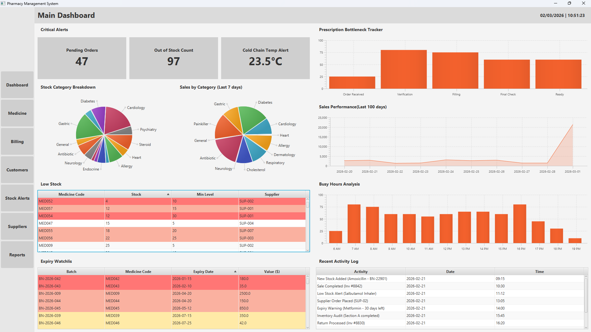
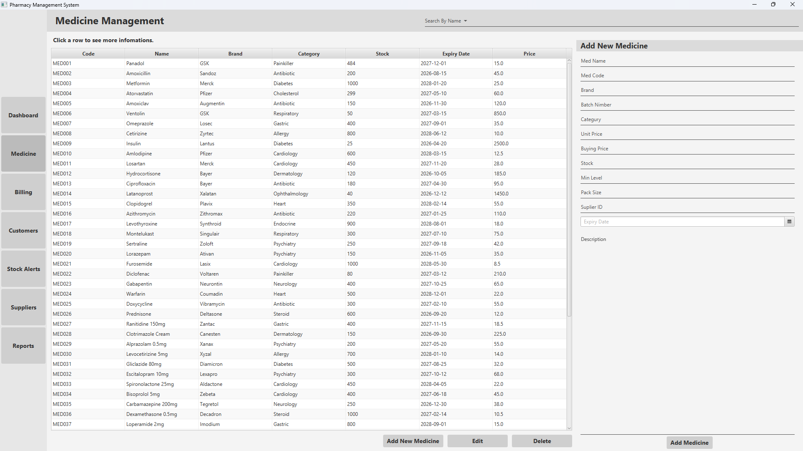
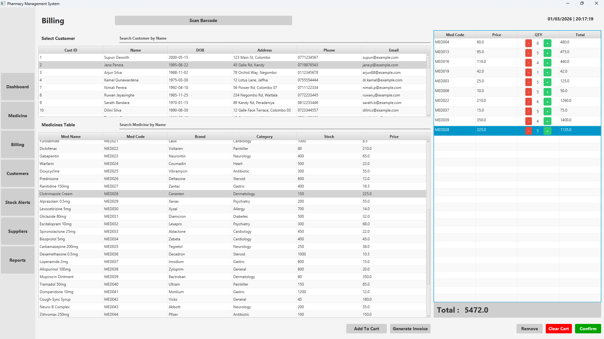
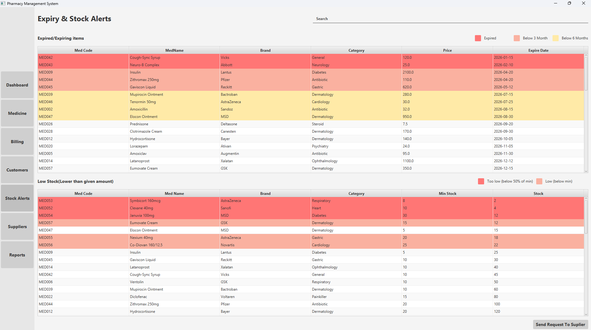

#  Pharmacy Management System 

[](https://www.oracle.com/java/)
[](https://openjfx.io/)
[](https://www.mysql.com/)
[](https://en.wikipedia.org/wiki/Multitier_architecture)
[](https://opensource.org/licenses/MIT)

> **A desktop solution designed to streamline pharmaceutical operations, inventory precision, and data-driven decision making.**

---
##  Table of Contents
- [System Overview](#system-overview)
- [Project Vision](#project-vision)
- [Tech Stack](#tech-stack)
- [Executive Summary](#executive-summary)
- [Core Features](#core-features)
- [Stakeholder Management](#stakeholder-management)
- [Software Architecture](#software-architecture)
- [Technical Implementation & Design Patterns](#technical-implementation--design-patterns)
- [Project Structure](#project-structure)
- [Future Roadmap](#️future-roadmap)
- [License](#license)
- [Author](#author)

---

##  System Overview

|  Main Dashboard |  Medicine Management |
| :---: | :---: |
|  |  |
| *Real-time analytics, busy hour tracking, and critical alerts.* | *Advanced CRUD operations and deep-dive inventory specs.* |

<br>

|  Point of Sale (Billing) |  Expiry & Stock Alerts |
| :---: | :---: |
|  |  |
| *Dynamic cart management with automated invoice generation.* | *Color-coded urgency watchlists and rapid supplier requesting.* |
---

##  Project Vision
The **Pharmacy Management System** is more than just a CRUD application. It is a high-performance desktop environment built to solve the "Expiry-Stock Gap" in pharmacies. By utilizing **Human-Computer Interaction (HCI)** principles and **Layered Architecture**, the system ensures that pharmacists can process transactions rapidly while the backend handles complex inventory calculations and predictive alerts.

### Key Problem Solvers:
* **Zero-Waste Expiry Tracking:** Automated color-coded watchlists for items expiring within 3 or 6 months.
* **Critical Stock Intelligence:** Real-time calculation of stock levels against "Minimum Stock Levels" to trigger re-order alerts.
* **Performance Analytics:** Visual breakdown of sales by category and busy hour analysis to optimize staffing.

---

##   Tech Stack
* **Language:** Java 17+
* **UI Framework:** JavaFX with Scene Builder (FXML)
* **Database:** MySQL 8.0
* **Design Pattern:** Singleton (DB Connection), Factory (UI Components), Layered Architecture (Controller-Service-Repository)
* **Build Tool:** Maven
* **Styling:** CSS3 for JavaFX

---

##   Executive Summary

In high-pressure pharmaceutical environments, manual inventory tracking often leads to two critical failures: **expired medication waste** and **unexpected stockouts** of life-saving drugs. 

The **Pharmacy Management System (V)** was engineered to bridge this gap. By implementing a proactive monitoring system, this application transforms a passive database into an active assistant. It doesn't just store data; it analyzes stock movement, predicts "Busy Hours" for better staffing, and uses high-visibility visual cues to ensure that no expired product ever reaches a customer.

**Key Objectives:**
* **Operational Efficiency:** Reducing the time taken for billing and stock entry.
* **Inventory Accuracy:** Real-time synchronization between sales and stock levels.
* **User-Centric Design:** Applying HCI principles to minimize user error during high-traffic hours.

---

##   Core Features

###  **1. Intelligent Dashboard**
* **Critical Alerts:** Instant visibility into Pending Orders, Out of Stock counts, and Cold Chain Temperature alerts.
* **Data Visualization:** Interactive Pie Charts for Category Breakdowns and Line Graphs for 100-day Sales Performance.
* **Busy Hour Analysis:** A bar chart visualization that helps managers understand peak traffic times (6 AM – 7 PM).

###  **2. Medicine & Inventory Management**
* **Smart Grid View:** A comprehensive table featuring Brand, Category, Stock levels, and Expiry Dates.
* **Detailed Sidebar:** Click any row to see a deep-dive into Batch Numbers, Buying vs. Selling prices, and pharmacological descriptions.
* **Advanced CRUD:** Integrated "Add/Edit/Delete" functionality with input validation to prevent data corruption.

###  **3. Dynamic Billing & CRM**
* **Dual-Search Interface:** Search by Customer Name or Medicine Name simultaneously to build a cart.
* **Barcode Readiness:** Designed for quick "Scan Barcode" integration to speed up the checkout process.
* **Automated Invoicing:** Real-time "Total" calculation with "Generate Invoice" capabilities for professional record-keeping.

###  **4. Expiry & Stock Watchdog**
To ensure patient safety and operational efficiency, the system splits critical alerts into two dedicated tracking modules, utilizing HCI visual cues to prevent errors:

**1. Expiry Tracking System:**
* 🔴 **Red (Critical):** Medication has already **Expired** and must be pulled from shelves.
* 🟠 **Light Red (Warning):** Expiring within **3 months** (High priority for clearance).
* 🟡 **Yellow (Notice):** Expiring within **6 months** (Active watchlist).

**2. Low Stock Alerts:**
* 🔴 **Red (Critical Stock):** Inventory is severely depleted (Dropped **below 50%** of the assigned minimum level).
* 🟠 **Light Red (Low Stock):** Inventory has dropped **below the minimum** required level.

**3. Automated Supplier Integration:**
* A built-in **"Send Request to Supplier"** capability allows managers to instantly generate re-order requests for flagged items directly from the alerts screen, streamlining the supply chain.

---

##   Stakeholder Management

### **Customer Management**
* Maintain a detailed registry of customer demographics (DOB, Address, Phone, Email).
* Track purchase history to provide personalized pharmaceutical care.

### **Supplier Relations**
* Monitor "Lead Time" in days to choose the most efficient suppliers.
* Track supplier status (Active/Pending/Inactive) to ensure a reliable supply chain.

---

##   Software Architecture

The **Pharmacy Management System (V)** is built using a **Layered Architecture**. This ensures a high degree of separation of concerns, making the system easier to test, maintain, and scale.

### **Architecture Layers:**
* **Presentation Layer (`controller`):** Manages the JavaFX UI components and handles user input via dedicated controllers for Medicine, Customers, Suppliers, and Billing.
* **Service Layer (`service`):** Contains the core business logic. It acts as a bridge, processing data from the UI before passing it to the data layer.
* **Data Access Layer (`repository`):** Handles all database interactions (CRUD operations) through a structured repository pattern.
* **Data Model Layer (`model`):** Utilizes **DTOs** (Data Transfer Objects) for safe data movement and **Entities** for database mapping.

### **Architecture Flow Diagram**

```text
┌───────────────────────────────────────────────┐
│              Presentation Layer               │
│         (JavaFX UI & Controllers)             │
└──────────────────────┬────────────────────────┘
                       │   ▲
          DTOs (Data)  │   │  DTOs
                       ▼   │
┌───────────────────────────────────────────────┐
│                 Service Layer                 │
│         (Core Business Logic & Rules)         │
└──────────────────────┬────────────────────────┘
                       │   ▲
     Entities (Models) │   │  Entities
                       ▼   │
┌───────────────────────────────────────────────┐
│               Data Access Layer               │
│        (Repositories & Custom CRUD)           │
└──────────────────────┬────────────────────────┘
                       │   ▲
        SQL Operations │   │  ResultSets
                       ▼   │
┌───────────────────────────────────────────────┐
│                MySQL Database                 │
│             (pharmacy_v schema)               │
└───────────────────────────────────────────────┘
```
---

##   Technical Implementation & Design Patterns

I have implemented several industry-standard **Design Patterns** to ensure the codebase remains clean and decoupled:

### **1. Factory Pattern**
Used in `ServiceFactory` and `RepositoryFactory` to centralize object creation. This allows the application to request an implementation (e.g., `MedicineService`) without needing to know the specific logic of how that object is instantiated.

### **2. Repository Pattern**
The project uses a `SuperRepository` interface and specific implementations like `MedicineRepositoryImpl` and `CustomerRepositoryImpl`. This abstracts the underlying database logic away from the business services.

### **3. Singleton Pattern**
The `DBConnection` class in the `db` package ensures that only one connection instance to the **MySQL** database exists at any given time, optimizing system resources.

### **4. Mapper Pattern**
To maintain strict separation between the database and the UI, I implemented custom mappers like `CustomertoDTOMapper` to convert database entities into transfer objects seamlessly.

### **5. HCI & UI Logic**
* **Dynamic Styling:** Table cells are dynamically formatted to provide visual alerts for "Low Stock" and "Expired" items.
* **Modular UI:** Each major feature (Medicine, Billing, Alerts) is isolated into its own FXML and Controller pair for better maintainability.


##   Project Structure

This project follows a strict Layered Architecture, separating the UI, Business Logic, and Data Access layers into distinct packages.

```text
Pharmacy-Management-System/
├── src/
│   ├── main/
│   │   ├── java/
│   │   │   ├── controller/
│   │   │   │   ├── customer/
│   │   │   │   │   ├── AddNewCustomerFormController.java
│   │   │   │   │   ├── CustomerInfoFormController.java
│   │   │   │   │   ├── CustomerManagementFormController.java
│   │   │   │   │   └── EditCustomerFormController.java
│   │   │   │   ├── medicine/
│   │   │   │   │   ├── AddNewMedicineFormController.java
│   │   │   │   │   ├── EditMedFormController.java
│   │   │   │   │   ├── MedicineInfoFormController.java
│   │   │   │   │   └── MedicineManagementController.java
│   │   │   │   ├── suplier/
│   │   │   │   │   ├── AddNewSuplierFormController.java
│   │   │   │   │   ├── EditSupplierFormController.java
│   │   │   │   │   ├── SuplierInfoFormController.java
│   │   │   │   │   └── SuplierManagementFormController.java
│   │   │   │   ├── BillingController.java
│   │   │   │   ├── ExpiryStockAlertsController.java
│   │   │   │   ├── MainDashBoardController.java
│   │   │   │   ├── RepoartsAnalyticsController.java
│   │   │   │   └── ScreenSelectorDashboardController.java
│   │   │   ├── db/
│   │   │   │   └── DBConnection.java
│   │   │   ├── mapper/
│   │   │   │   ├── CustomertoDTOMapper.java
│   │   │   │   └── SuplierMapper.java
│   │   │   ├── model/
│   │   │   │   ├── dto/
│   │   │   │   ├── entity/
│   │   │   │   └── tm/
│   │   │   ├── repository/
│   │   │   │   ├── custom/
│   │   │   │   │   ├── impl/
│   │   │   │   │   │   ├── BuyerOrderRepositoryImpl.java
│   │   │   │   │   │   ├── CustomerRepositoryImpl.java
│   │   │   │   │   │   ├── MedicineRepositoryImpl.java
│   │   │   │   │   │   ├── RecentActivityRepositoryImpl.java
│   │   │   │   │   │   ├── SuplierOrderRepositoryImpl.java
│   │   │   │   │   │   └── SuplierRepositoryImpl.java
│   │   │   │   │   ├── BuyerOrderRepository.java
│   │   │   │   │   ├── CustomerRepository.java
│   │   │   │   │   ├── MedicineRepository.java
│   │   │   │   │   ├── RecentActivityRepository.java
│   │   │   │   │   ├── SuplierOrderRepository.java
│   │   │   │   │   └── SuplierRepository.java
│   │   │   │   ├── CrudRepository.java
│   │   │   │   ├── RepositoryFactroy.java
│   │   │   │   └── SuperRepository.java
│   │   │   ├── service/
│   │   │   │   ├── custom/
│   │   │   │   │   ├── impl/
│   │   │   │   │   │   ├── BillingServiceImpl.java
│   │   │   │   │   │   ├── CustomerManagementServiceImpl.java
│   │   │   │   │   │   ├── ExpiryStockAlertsServiceImpl.java
│   │   │   │   │   │   ├── MainDashBoardServiceImpl.java
│   │   │   │   │   │   ├── MedicineManagementServiceImpl.java
│   │   │   │   │   │   ├── RepoartsAnalyticsServiceImpl.java
│   │   │   │   │   │   └── SuplierManagementServiceImpl.java
│   │   │   │   │   ├── BillingService.java
│   │   │   │   │   ├── CustomerManagementService.java
│   │   │   │   │   ├── ExpiryStockAlertsService.java
│   │   │   │   │   ├── MainDashBoardService.java
│   │   │   │   │   ├── MedicineManagementService.java
│   │   │   │   │   ├── RepoartsAnalyticsService.java
│   │   │   │   │   └── SuplierManagementService.java
│   │   │   │   ├── ServiceFactory.java
│   │   │   │   └── SuperService.java
│   │   │   ├── util/
│   │   │   │   ├── RepositoryType.java
│   │   │   │   └── ServiceType.java
│   │   │   ├── Main.java
│   │   │   └── Starter.java
│   │   └── resources/
│   └── test/
├── target/
├── .gitignore
└── README.md
```
---

##   Future Roadmap
I am continuously looking to improve this system. Planned upcoming features include:
* **Cloud Database Integration:** Migrating from local MySQL to an AWS RDS instance for remote access.
* **Reporting Module:** Exporting sales and inventory data to PDF and Excel formats.

---

##   License
This project is licensed under the MIT License - see the [LICENSE](LICENSE) file for details.

---

##  Author

**Supun Dewsith**

